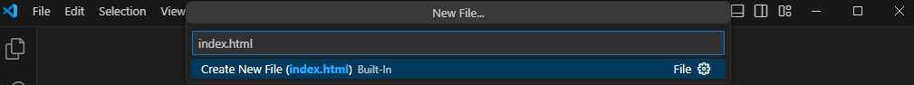
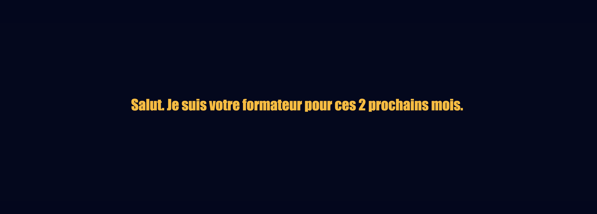
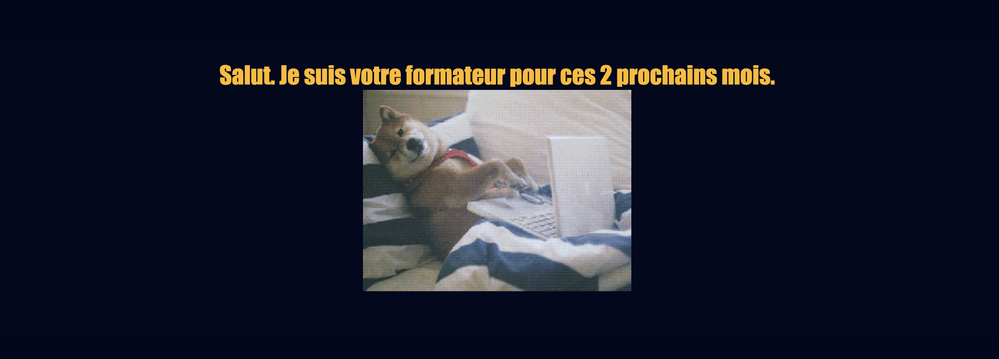

# Test Technique

## Préinscription

Avant de commencer ce petit test, est-ce que tu t'es bien pré-inscrit sur notre site web ? Si ce n'est pas le cas visite le site [Sirius School](https://siriusschool.be/). Il est **obligatoire** de te préinscrire sinon nous n'aurons aucun moyen de te contacter.

## Le test peut démarrer

Salut à toi, jeune apprenti. Voici un petit test pour évaluer tes compétences en informatique et déterminer si tu es apte à rentrer dans une initiation chez Sirius.

- Durée du test: 30 minutes max. :clock1:
- Google est ton ami si tu as des questions :mag_right:
- Quand tu as fini ton test ou que tu es arrivé le plus loin possible, demande pour passer ton entretien. :eyeglasses:

Pour commencer, il te suffit de suivre à la lettre les instructions suivantes. Prend bien ton temps pour lire chaque phrase correctement et ne pas te tromper.

## Les fondations

1\. Sur le bureau de ton ordinateur, crée un **nouveau dossier** que tu nommeras de ton **nom-prénom** (ex: Scala-Jeremy).

> :bulb: Utilise le clic droit pour créer des dossiers et fichiers

2\. Ouvre l'application `Visual Studio Code`

> :bulb: Recherche ce programme dans le menu `Démarrer` de Windows

3\. Dans VSCode, **ouvre le dossier** qu'on a créé plus tôt sur le bureau qui porte ton nom et prénom. Si VSCode te demande si tu peux faire confiance aux fichiers dans ce dossier tu peux répondre "Oui, j'ai confiance".

> :bulb: Toutes les actions principales d'un logiciel se trouvent dans le menu `Fichier`

4\. Toujours dans VSCode, crée maintenant un **nouveau fichier** et nomme le **index.html** dans le champ qui apparaît, valide avec `Enter`. Puis dans la fenêtre suivante, appuie de nouveau sur `Enter`.



5\. Écris, dans ce document, quelques phrases pour te présenter. Tu peux nous donner ton parcours, tes passions, tes vacances idéales,... bref lâche toi, mais n'écris pas non plus un roman :D
6\. Sauvegarde ce document.

> :bulb: Tu peux utiliser le raccourcis `ctrl + s` ou utiliser le menu `Fichier`

:tada: Bravo, tu es arrivé jusqu'ici, c'est super. Sans le savoir, tu viens de réaliser ta première page HTML. Mais pour le moment il n'y a que du texte, on va mettre maintenant quelques termes spécifique à l'HTML. Ne t'en fais pas, il suffit de faire du copier-coller pour le moment. Les explications viendront lors des cours :)

7\. Sélectionne et copie-colle le code suivant en dessous de ta présentation.

```html
<html>
  <head>
    <title>Je suis un titre</title>
  </head>
  <body>
   <div class="container">
      <div>
        <p></p>
      </div>
    </div>
  </body>
</html>
```

> :bulb: Tu peux utiliser les raccourcis suivant `ctrl + c` et `ctrl + v` ou utiliser le menu `Edition`

> :bulb: Utilise la touche `Enter` pour allez à la ligne après ta présentation.

8\. Sélectionne, coupe puis colle ta présentation entre ``<p>`` et ``</p>``

> :bulb: Tu peux utiliser le raccourci `ctrl + x` pour couper ou utiliser le menu `Edition`

Exemple:

```html
<p>Salut. Je suis l'un de tes formateurs de ces 6 prochains mois.</p>
```

9\. Remplace la phrase **Je suis un titre** par ton pseudo ou ton nom.

10\.  Sauvegarde le fichier.

11\.  Retourne sur le bureau, puis dans le dossier et double-clic sur le fichier `index.html` pour l'ouvrir dans un navigateur et voir le résultat.

> :bulb: Tu devrais voir ton texte en noir sur fond blanc. Vérifie le titre de l'onglet de ta page web pour voir si il affiche bien ton pseudo ou ton nom.

:tada: Bravo, tu viens de réaliser ta première page web en HTML. Si tu as réussi toutes ces étapes sans difficultés alors tu es prêt(e) pour suivre les cours chez Sirius School.

Si tu as encore le temps, je te conseille d'essayer la suite du test tout de même. Sinon, viens me trouver et on discutera 5 minutes.

## L'apprentissage

Tu as décidé de continuer, super. On va un peu embellir ta page.

1\. Copie/colle ce bout de code entre ``<head>`` et ``</head>`` **et** en dessous de ``</title>`` sur une nouvelle ligne.

> :bulb: Place simplement ton curseur à la fin de ``</title>`` et va à la ligne.

```html
    <style>
      * {
        margin: 0;
      }
      body {
        background-color: #03071E;
      }
      .container{
        display: flex;
        justify-content: center;
        align-items: center;
        height: 100vh;
      }
      p {
        color: #FFBA08;
        font-family: Impact, sans-serif;
        font-size: 36px;
      }
    </style>
```

Tu devrais avoir quelque chose qui ressemble à ceci si tu sauvegarde ton fichier et rafraîchis (F5) ton fichier dans ta fenêtre de navigateur. Si ce n'est pas le cas, c'est que tu t'es trompé. Reviens en arrière et ré-essaye ou alors appel moi.



2\. Maintenant que tout est en couleur, peut-être que ce n'est pas à ton goût. Alors essaye donc de changer le **background-color** (couleur de fond) et la **color** (couleur) du texte. Remplace `#03071E` et/ou `#FFBA08` par une autre valeur (voir paragraphe suivant).

> :bulb: Un code couleur en HTML peut avoir différentes valeurs. Dans notre cas il s'agit d'un code **HEX** ou **Hexadecimal**. Celui-ci commence toujours par un hashtag (#) et est suivis de 6 caractères (lettres et numéro).

> :toolbox: Tu peux utiliser [html-colors](https://htmlcolorcodes.com/) pour avoir des idées de couleurs. Copie le code **HEX** et remplace le dans ton code. Ouvre la page avec le clic molette ou en maintenant `CTRL + clic` pour ne pas perdre ta page web et ouvrir celle-ci dans un nouvel onglet.

3\. Ajoutons maintenant une image. Sélectionne et copie-colle le code suivant en dessous de ton texte (après ``</p>`` sur une nouvelle ligne).

```html

```

4\. Centrons cette image. Rajoute le code suivant avant la ligne ``</style>``, sur une nouvelle ligne.

```css
img {
        margin:auto;
        display: block;
      }
```

Voilà le résultat:



Si tu veux, et que tu as compris comment fonctionne l'HTML, tu peux changer l'image aussi. Trouve un gif rigolo qui te représente sur [Giphy](http://www.giphy.com) (utilise la barre de recherche et clique sur "copy link" et choisis "GIF link") ou va sur  [Google](http://www.google.com) (utilise le clic droit et choisis "Copier l'adresse de l'image")

## Félicitations

:tada: Tu es arrivé à la fin, félicitations ! Montre moi le résultat puis nous irons discuter 5 minutes pour la suite de ton inscription.
